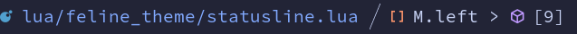

# feline_theme.nvim

This is a opinionated feline config designed to be used as a plugin. It automatically picks colors from applied colorscheme.

## Requirements:

- Neovim >= 0.8
- [feline.nvim](https://github.com/feline-nvim/feline.nvim)
- [nvim-navic](https://github.com/SmiteshP/nvim-navic) (optional)
- [nvim-treesitter](https://github.com/nvim-treesitter/nvim-treesitter) (optional)

## Screenshots:

#### Statusline


#### Winbar



## Installation:

### Note: Make sure that you always load your colorscheme first.
#### Anoter Note: You can't use only winbar. That will not work.

### Packer:

```
use {
  "Hitesh-Aggarwal/feline_theme.nvim",
  -- after = [Applied colorscheme here]
  config = function()
    require("feline_theme").setup() -- for statusline
    require("feline_theme").setup_winbar() -- for winbar
  end
}
```

### vim-plug:

```
Plug 'Hitesh-Aggarwal/feline_theme.nvim'

" Anywhere in your config:
lua << EOF
  config = function()
    require("feline_theme").setup() -- for statusline
    require("feline_theme").setup_winbar() -- for winbar
  end
EOF
```

### Lazy:

```
return {
  "Hitesh-Aggarwal/feline_theme.nvim",
  -- dependencies = {
  --   [[ Applied colorscheme here ]]
  -- Or you can set the priority of your colorscheme to 1000 so that it loads first.
  -- }
  config = function()
    require("feline_theme").setup() -- for statusline
    require("feline_theme").setup_winbar() -- for winbar
  end
}
```

### Configuration:

```
local format = function(arg)
  return "#" .. string.format("%06x", arg)
end

local giv_foreground = function(group)
  return format(get_hl(group, true).foreground)
end

local giv_background = function(group)
  return format(get_hl(group, true).background)
end

require("feline_theme").setup({
  fg = giv_foreground("Normal"),
  bg = giv_background("CursorLine"),
  bg_dark = giv_background("Normal"),
  green = giv_foreground("DiffAdded"),
  yellow = giv_foreground("WarningMsg"),
  purple = giv_foreground("Special"),
  orange = giv_foreground("Number"),
  red = giv_foreground("Error"),
  blue = giv_foreground("Title"),
  -- these are the defaults. You can change any color.
  -- Do add or remove any other colors. Just change the values
  -- of these predefined colors.
  -- For example:
  -- red = "#ff0000"
})
```

## Contribute

**Please consider raising a pull request for improvements**
